# Reasoning Trace System

## Overview

The Reasoning Trace System provides comprehensive transparency into DevBot's decision-making process, similar to OpenAI Frontier's reasoning display. It captures, stores, and visualizes the step-by-step thoughts, actions, observations, and reflections during agent execution.

## Architecture

```
src/reasoning/
├── trace.ts          # Core trace capture and types
├── visualizer.ts     # Multi-platform formatting (Markdown, Slack, Discord, Mermaid)
src/services/
├── reasoning-trace.ts # Database persistence
src/agents/
├── orchestrator.ts    # Integrated trace capture
scripts/
├── show-reasoning.ts  # CLI tool to view traces
tests/reasoning/
├── trace.test.ts      # Core functionality tests
├── visualizer.test.ts # Formatting tests
└── integration.test.ts # Orchestrator integration tests
```

## Key Components

### 1. TraceCapture Class

Captures reasoning steps during agent execution with four step types:

- **Thought** 💭 - Internal reasoning and planning
- **Action** ⚡ - Concrete actions taken
- **Observation** 👁️ - Results and outcomes
- **Reflection** 🔄 - Analysis and lessons learned

**Example Usage:**

```typescript
import { TraceCapture } from "@/reasoning/trace";

const trace = new TraceCapture("task-123", "frontend");

// Record reasoning steps
trace.thought("Need to create a React component", {
  confidence: 0.8,
  alternatives: ["Create functional component", "Create class component"]
});

trace.action("Creating functional component");
trace.observation("Component created successfully");
trace.reflection("Functional component is more concise", { confidence: 0.9 });

// Complete the trace
trace.complete(true, "Component implementation finished");

// Get the trace
const reasoningTrace = trace.getTrace();
```

### 2. TraceVisualizer Class

Formats traces for different platforms:

```typescript
import { TraceVisualizer } from "@/reasoning/visualizer";

const visualizer = new TraceVisualizer(trace.getTrace());

// Generate Markdown with collapsible sections
const markdown = visualizer.toMarkdown();

// Generate Slack Block Kit JSON
const slackBlocks = visualizer.toSlackBlocks();

// Generate Discord embed
const discordEmbed = visualizer.toDiscordEmbed();

// Generate Mermaid decision tree diagram
const mermaid = visualizer.toMermaidDiagram();
```

### 3. Database Persistence

Traces are stored in PostgreSQL with the following schema:

```sql
CREATE TABLE reasoning_traces (
  id TEXT PRIMARY KEY,
  task_id TEXT REFERENCES tasks(id) ON DELETE CASCADE,
  agent_role TEXT,
  steps JSONB NOT NULL,
  started_at TIMESTAMP NOT NULL,
  completed_at TIMESTAMP,
  total_steps INTEGER DEFAULT 0,
  success BOOLEAN DEFAULT FALSE,
  final_decision TEXT,
  metadata JSONB,
  created_at TIMESTAMP DEFAULT NOW()
);
```

**Service Functions:**

```typescript
import { saveReasoningTrace, getReasoningTracesForTask } from "@/services/reasoning-trace";

// Save a trace
await saveReasoningTrace(trace.getTrace());

// Retrieve traces for a task
const traces = await getReasoningTracesForTask("task-123");
```

### 4. Orchestrator Integration

The orchestrator automatically captures reasoning during:

- **Plan Decomposition** - Breaking down complex tasks
- **Subtask Execution** - Individual agent operations
- **Verification** - Code review and validation

```typescript
import { planDecomposition, executeSubtask, verifyAgentOutput } from "@/agents/orchestrator";
import { TraceCapture } from "@/reasoning/trace";

const trace = new TraceCapture("parent-task", "orchestrator");

// Planning with trace capture
const plan = await planDecomposition(
  "Build login form",
  "myapp/frontend",
  fileContents,
  trace
);

// Execution with trace capture
const result = await executeSubtask(subtask, fileContents, trace);

// Verification with trace capture
const verification = await verifyAgentOutput(task, result, trace);

// Save the trace
await saveReasoningTrace(trace.getTrace());
```

## CLI Usage

View reasoning traces for any task:

```bash
# Basic text format
npm run show-reasoning task-123

# Markdown format with collapsible sections
npm run show-reasoning task-123 --format=markdown

# Mermaid diagram
npm run show-reasoning task-123 --format=mermaid

# Raw JSON export
npm run show-reasoning task-123 --format=json
```

**Example Output:**

```
🔍 Fetching reasoning traces for task: task-123

✅ Found 1 trace(s)

================================================================================

=== Reasoning Trace: trace-xyz ===
Task: task-123
Agent: frontend
Started: 2026-02-22T12:30:00.000Z
Completed: 2026-02-22T12:30:45.500Z (45500ms)
Success: true
Final Decision: Component implementation finished
Total Steps: 4

[12:30:00.100] 💭 THOUGHT
  Need to create a React component
  Confidence: 80%
  Alternatives considered:
    - Create functional component
    - Create class component

[12:30:15.200] ⚡ ACTION
  Creating functional component

[12:30:40.300] 👁️ OBSERVATION
  Component created successfully

[12:30:45.400] 🔄 REFLECTION
  Functional component is more concise
  Confidence: 90%
```

## Advanced Features

### Confidence Tracking

Steps can include confidence scores (0-1) indicating certainty:

```typescript
trace.thought("Choosing implementation strategy", {
  confidence: 0.75,
  alternatives: ["Strategy A", "Strategy B", "Strategy C"]
});

// Calculate average confidence across all steps
const avgConfidence = trace.getAverageConfidence();
```

### Alternatives Recording

Capture alternative approaches considered:

```typescript
trace.action("Using REST API", {
  alternatives: ["GraphQL", "gRPC", "WebSockets"],
  metadata: { chosenReason: "Better compatibility" }
});
```

### Metadata Attachment

Attach arbitrary metadata to traces or steps:

```typescript
trace.setMetadata("repository", "devbot/frontend");
trace.setMetadata("branch", "feature/login");

trace.action("Running build", {
  metadata: { 
    buildTool: "vite", 
    duration: 1500,
    exitCode: 0
  }
});
```

### Merging Multiple Traces

Combine traces from parallel subtasks into a unified timeline:

```typescript
import { mergeTraces } from "@/reasoning/trace";

const traces = await getReasoningTracesForTask("parent-task");
const merged = mergeTraces(traces);

// Merged trace contains all steps in chronological order
// Success is true only if ALL traces succeeded
```

## Visualization Examples

### Markdown Format

- Collapsible `<details>` sections for each step
- Statistics table with step counts
- Confidence bars: `██████████░░░░░░░░░░ 85%`
- Timeline with relative timestamps

### Slack Block Kit

- Header with task metadata
- Fields for key information
- Section blocks for each step
- Truncated to fit Slack's block limits

### Discord Embed

- Color-coded (green for success, red for failure)
- Fields for each step (truncated to 200 chars)
- Footer with trace ID
- Timestamp for when trace started

### Mermaid Diagram

```mermaid
graph TD
  Start[Task task-123]
  S0(💭 thought: Need to create component)
  S1[⚡ action: Creating component]
  S2{👁️ observation: Created successfully}
  S3[[🔄 reflection: Functional is better]]
  End[✅ Success]
  
  Start --> S0
  S0 --> S1
  S1 --> S2
  S2 --> S3
  S3 --> End
  
  A1_0[Alt: Class component]
  S0 -.-> A1_0
  
  style S0 fill:#9f9
  style S3 fill:#9f9
  style End fill:#9f9
```



## Benefits

1. **Transparency** - See exactly how DevBot makes decisions
2. **Debugging** - Understand why tasks succeeded or failed
3. **Learning** - Identify patterns in agent reasoning
4. **Accountability** - Audit trail for all agent actions
5. **Improvement** - Find areas where agents can be optimized

## Testing

Run the test suite:

```bash
# All reasoning tests
npm test tests/reasoning

# Specific test files
npx vitest run tests/reasoning/trace.test.ts
npx vitest run tests/reasoning/visualizer.test.ts
npx vitest run tests/reasoning/integration.test.ts
```

Test coverage includes:
- ✅ Trace capture with all step types
- ✅ Confidence calculation
- ✅ Alternative tracking
- ✅ Metadata management
- ✅ Step filtering by type
- ✅ Trace completion
- ✅ Markdown formatting
- ✅ Slack Block Kit generation
- ✅ Discord embed generation
- ✅ Mermaid diagram generation
- ✅ Orchestrator integration
- ✅ Database persistence

## Future Enhancements

- [ ] Real-time trace streaming to Slack/Discord
- [ ] Interactive trace visualization UI
- [ ] Trace comparison between different approaches
- [ ] Automatic confidence calibration based on outcomes
- [ ] Trace-based agent performance metrics
- [ ] Export to OpenAI Frontier reasoning format
- [ ] Integration with observability tools (DataDog, New Relic)
- [ ] Trace replay for debugging

## Related Files

- [Agent Workflow Rules](.claude/AGENTS.md) - Multi-agent orchestration patterns
- [Database Schema](src/db/schema.ts) - Full schema including reasoning_traces
- [Agent Types](src/agents/types.ts) - AgentTask and AgentResult types
- [Orchestrator](src/agents/orchestrator.ts) - Main orchestration logic

## License

UNLICENSED - Part of DevBot/FunBot autonomous AI system
